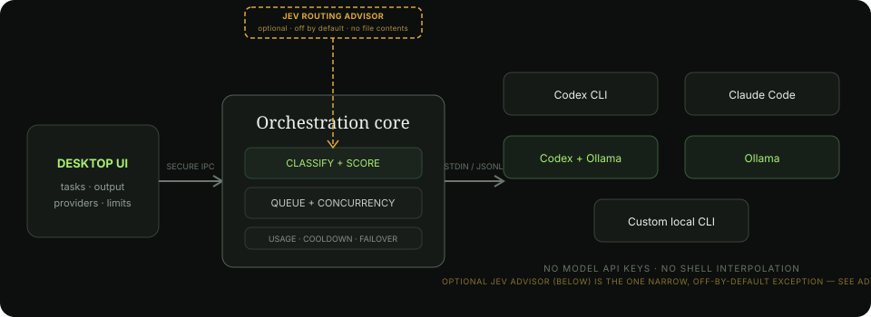

# Frontier Proxy

Frontier Proxy is a local-first desktop orchestrator for **Codex CLI**, **Claude Code**, **GitHub Copilot CLI**, and **Ollama-backed coding models**. It sends work to executables already installed and authenticated on your computer; it does not call model APIs or require API keys of its own.



## What works

- Detects enabled local providers and their CLI versions.
- Classifies tasks as coding, debugging, review, planning, documentation, or general work.
- Routes with `Balanced`, `Quality first`, or `Token saver` policies.
- Balances recent task/token estimates across subscriptions and respects optional per-provider daily budgets.
- Runs multiple independent tasks in parallel while respecting global and per-provider concurrency.
- Streams provider output, keeps a local task history, supports cancellation, retries, and explicit provider switching between turns.
- Opens each task in a dedicated workspace with its conversation, task-scoped context meter, route/activity history, and syntax-highlighted source and diff views for recorded file changes.
- Accepts image attachments by picker, paste, or drag-and-drop, and resolves `@` file/folder references from the task's selected working directory.
- Provides a keyboard-first command palette for navigation, common actions, and task lookup (`⌘K` on macOS or `Ctrl+K` elsewhere).
- Shows per-provider session usage, reset information, and the latest context-window occupancy.
- Detects quota/rate-limit/overload errors, cools that provider down, and fails over to the next eligible provider across first turns, follow-ups, and orchestrated runs.
- Runs Codex in `workspace-write`, Claude Code in `acceptEdits`, and every process with `shell: false`.
- Packages for macOS, Windows, and Linux with Electron Builder.

## Start it

Prerequisites: Node.js 22+, pnpm, and at least one supported CLI.

```bash
pnpm install
pnpm dev
```

Production build and unpacked desktop package:

```bash
pnpm typecheck
pnpm test
pnpm package
```

Create distributable installers on each target operating system with `pnpm dist`. Electron Builder produces DMG/ZIP on macOS, NSIS/portable on Windows, and AppImage/DEB on Linux. Native installers should normally be built on their target OS or in a CI matrix.

## Download builds

Latest release: **[v0.6.2](https://github.com/ThisaST/Frontier-Proxy/releases/latest)**

| Platform | Download |
| --- | --- |
| macOS (disk image) | [Frontier.Proxy-0.6.2.dmg](https://github.com/ThisaST/Frontier-Proxy/releases/download/v0.6.2/Frontier.Proxy-0.6.2.dmg) |
| macOS (zip) | [Frontier.Proxy-0.6.2-mac.zip](https://github.com/ThisaST/Frontier-Proxy/releases/download/v0.6.2/Frontier.Proxy-0.6.2-mac.zip) |
| Windows (installer) | [Frontier.Proxy.Setup.0.6.2.exe](https://github.com/ThisaST/Frontier-Proxy/releases/download/v0.6.2/Frontier.Proxy.Setup.0.6.2.exe) |
| Windows (portable) | [Frontier.Proxy.0.6.2.exe](https://github.com/ThisaST/Frontier-Proxy/releases/download/v0.6.2/Frontier.Proxy.0.6.2.exe) |
| Linux (AppImage) | [Frontier.Proxy-0.6.2.AppImage](https://github.com/ThisaST/Frontier-Proxy/releases/download/v0.6.2/Frontier.Proxy-0.6.2.AppImage) |
| Linux (Debian/Ubuntu) | [frontier-proxy_0.6.2_amd64.deb](https://github.com/ThisaST/Frontier-Proxy/releases/download/v0.6.2/frontier-proxy_0.6.2_amd64.deb) |

Builds are x64 and unsigned. On macOS, open the app the first time with **Control-click → Open**; on Windows, choose **More info → Run anyway** in SmartScreen. Every version is kept on the [releases page](https://github.com/ThisaST/Frontier-Proxy/releases).

### Development builds

GitHub Actions builds Windows, macOS, and Linux installers after every push to `main`, when a `v*` tag is pushed, or when the workflow is started manually. Open the repository's **Actions** tab, select a successful **Build desktop apps** run, and download the artifact for your platform. Build artifacts are retained for 30 days.

Version tags also create a GitHub Release with the installers attached for permanent public downloads. For example:

```bash
git tag v0.2.0
git push origin v0.2.0
```

## Provider setup

In the app, open **Providers** in the left sidebar:

1. Codex, Claude Code, and GitHub Copilot are already registered; do not add them again. Leave the executable fields as `codex`, `claude`, and `copilot`, enable the providers you use, and select **Check providers**.
2. A green **Ready** status confirms that the packaged app can locate the CLI. If it says **Not detected**, run `command -v codex`, `command -v claude`, or `command -v copilot` in Terminal and paste that absolute path into the provider's Executable field.
3. Configure an optional model, tracked usage limit, and context-window size, then select **Save provider**. A CLI-reported context limit takes precedence over the configured fallback.
4. Use **Add custom CLI** only for another locally installed agent executable.

The app version is shown at the bottom of the sidebar. GitHub Copilot support requires v0.2.0 or newer.

### Codex

Install and sign in to Codex CLI, then leave the executable as `codex`. Frontier runs:

```text
codex exec --json --sandbox workspace-write --skip-git-repo-check -C <workspace> -
```

The task prompt is written to stdin. Image turns add Codex's native `--image <path>` arguments, while `@` references are resolved to validated paths inside the selected workspace. Existing Codex login and local configuration are reused.

### Claude Code

Install and sign in to Claude Code, then leave the executable as `claude`. Frontier uses print/streaming mode with `acceptEdits`. Existing Claude Code login and settings are reused. Extra CLI flags, such as allowed tools, can be configured on the Providers screen.

### GitHub Copilot

Install the current standalone GitHub Copilot CLI—this integration does not use the retired `gh copilot` extension:

```bash
# macOS or Linux
brew install --cask copilot-cli

# Or on any platform with Node.js 22+
npm install -g @github/copilot

copilot login
```

Leave the provider executable as `copilot`, then enable it and select **Check providers**. Frontier sends prompts through stdin in Copilot's non-interactive silent mode. By default it grants file writes and common Git/package/build commands, but it does not grant `--allow-all`. Add or replace `--allow-tool` rules in Extra arguments if a project needs different tools. An optional model can be entered using a model name supported by your Copilot plan.

The provider card also lets you extend Copilot's built-in GitHub MCP server with selected toolsets or individual tools. Enabling every GitHub MCP tool is available as an explicit override; otherwise Copilot keeps its default CLI subset plus your selections.

Official references: [installing Copilot CLI](https://docs.github.com/en/copilot/how-tos/copilot-cli/set-up-copilot-cli/install-copilot-cli) and [programmatic CLI options](https://docs.github.com/en/copilot/reference/copilot-cli-reference/cli-programmatic-reference).

### Open-source models

Start Ollama and pull a coding model, for example:

```bash
ollama pull qwen3-coder
ollama serve
```

Then enable one of these providers:

- **Codex + Ollama** uses Codex's agent harness with `--oss --local-provider ollama`. It can perform coding tasks with local inference.
- **Ollama** invokes `ollama run` directly. It is intentionally limited to planning, review, documentation, and general tasks because the raw model runner has no file-editing agent tools.

Change the configured model to one installed on your Ollama instance.

### Other local agent CLIs

Choose **Add custom CLI** in the provider registry. Configure the executable and its argument list; quoted arguments are supported. The prompt is sent over stdin by default. Use `{prompt}` in one argument only when a tool requires the prompt as an argv value, plus `{cwd}` and `{model}` for the selected working directory and configured model. Custom processes are still launched directly with no intermediary shell.

## Routing

Eligible providers must be enabled, detected, below their concurrency and optional token limits, outside a cooldown, and below any plan-window percentage reported by the CLI. Frontier then scores:

1. User provider override.
2. Routing policy (quality vs. local usage saving).
3. Task/provider affinity.
4. User-set priority.
5. Today's locally estimated usage and current load.

Only quota/unavailable failures automatically fail over. Intentional cancellation never triggers provider switching, and later messages remain pinned to the last provider unless the user changes the **Next provider** selector. A normal agent failure stops the task, because rerunning a partially completed coding task through another agent could duplicate or conflict with edits. When a follow-up moves to another provider, Frontier replays the complete attributed conversation transcript—including partial or cancelled responses—to the replacement provider.

## Important boundaries

- Frontier proxies **CLI processes**, not the private internals or UI automation of the Codex/Claude desktop apps. This is the stable local integration surface and still reuses the account sessions available to those CLIs.
- Subscription tools do not expose a reliable, universal local “tokens remaining” interface. Frontier therefore tracks conservative local estimates and learns temporary unavailability from CLI errors. Optional daily budgets give you deterministic control.
- Context occupancy is not inferred from cumulative billing usage. Claude reports enough per-request data for a live task context gauge; providers that do not expose current conversation occupancy show either a clearly labeled estimate (when a context-window fallback is configured) or “Not reported.”
- Direct Ollama output is not an agent. Use Codex + Ollama when a local model needs filesystem and shell tools.
- Every task agent can modify its selected working directory. Review the provider permission mode and use version control.

## macOS permissions and folder selection

The normal folder chooser and projects under your home directory do not require Full Disk Access. Choose **New task → Choose folder… → Use this folder**, or paste an absolute path into the field. Full Disk Access is only relevant for protected locations such as Mail, Messages, some system folders, or another user's data.

If a provider is Ready but later receives an operating-system permission error, grant access to **Frontier Proxy** and the relevant CLI host in **System Settings → Privacy & Security**, then restart the app. A provider that says Not detected is normally a PATH/executable configuration issue, not a filesystem permission issue.

## Data and security

State is stored in Electron's per-user application-data directory as `frontier-state.json`. Prompts are passed through stdin by default and never interpolated into a shell command. Executables are launched with a cross-platform argument-safe process wrapper (including Windows `.cmd` shims). Renderer code has no Node.js access; a small context-isolated preload API exposes only task and settings operations. No telemetry is included.

## Project layout

```text
src/main/       queue, router, process adapters, persistence, Electron main
src/preload/    narrow typed IPC bridge
src/renderer/   desktop user interface
src/shared/     shared types, defaults, task classification
tests/          routing, classification, persistence, process-safety tests
```
